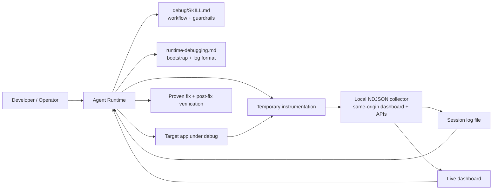

# JUNERDD Skills

Reusable AI agent skills published from a single repository.

This repository is a skill collection, not a single-skill package. Installable skills live under [`skills/`](./skills/), and each subfolder is meant to be independently installable, versioned, and expanded over time.

## Install

List the skills currently published from this repository:

```bash
npx skills add JUNERDD/skills --list
```

Install the current `debug` skill:

```bash
npx skills add JUNERDD/skills --skill debug
```

Install `debug` globally for Codex:

```bash
npx skills add JUNERDD/skills --skill debug -g -a codex -y
```

Manual install still works if your runtime does not use the `skills` CLI. Copy [`skills/debug/`](./skills/debug/) into your local skill directory:

```bash
mkdir -p ~/.agents/skills
cp -R ./skills/debug ~/.agents/skills/
```

## Repository Model

- Each installable skill lives under `skills/<skill-name>/`.
- Each skill owns its own `SKILL.md` plus any optional `agents/`, `references/`, `scripts/`, or `assets/` directories.
- Root-level files describe the repository as a collection. Skill-specific behavior and deep operational details stay inside the relevant skill folder.
- Shared repository assets such as screenshots can live outside `skills/` when they are not part of the installable package itself.

## Current Skills

### `debug`

[`skills/debug/`](./skills/debug/) provides evidence-first runtime debugging for application bugs, regressions, flaky behavior, and unclear runtime failures.

Key entry points:

- Workflow and guardrails: [`skills/debug/SKILL.md`](./skills/debug/SKILL.md)
- Operator reference: [`skills/debug/references/runtime-debugging.md`](./skills/debug/references/runtime-debugging.md)
- Local NDJSON collector: [`skills/debug/scripts/local_log_collector/`](./skills/debug/scripts/local_log_collector/)
- Optional runtime metadata: [`skills/debug/agents/openai.yaml`](./skills/debug/agents/openai.yaml)

### `debug` Skill Snapshot

The `debug` skill is designed to prevent speculative fixes by forcing a prove-it loop:

1. Generate precise hypotheses.
2. Attach to or start an authoritative logging session.
3. Add minimal temporary instrumentation.
4. Reproduce the issue and read the recorded log file.
5. Mark each hypothesis as `CONFIRMED`, `REJECTED`, or `INCONCLUSIVE`.
6. Apply a fix only after the root cause is proven.
7. Verify with fresh post-fix logs before removing instrumentation.

This keeps the skill focused on evidence, not guesswork.

### `debug` Architecture



### `debug` Highlights

- Evidence-first debugging instead of inspection-only reasoning
- Minimal instrumentation with explicit cleanup after verification
- Per-hypothesis logging and before/after comparison
- Local collector bootstrap when the host does not already provide logging
- Browser-first log transport for frontend debugging, with explicit prohibition on app-local proxy routes unless direct delivery is proven blocked

### `debug` Runtime Support

The current `debug` skill is intentionally portable. It works with:

- OpenAI Codex and similar local-skill runtimes
- Agent shells that read `~/.agents/skills/<name>/SKILL.md`
- Custom agent frameworks that mount a skill folder and inject `SKILL.md` into context
- Internal toolchains that want the collector, references, or workflow as reusable assets

If your runtime ignores [`skills/debug/agents/openai.yaml`](./skills/debug/agents/openai.yaml), the core logic is still fully available through [`skills/debug/SKILL.md`](./skills/debug/SKILL.md).

### `debug` Dashboard Preview


### `debug` Collector

The bundled collector is a zero-dependency Python app built on the standard library. It accepts JSON log events, appends them to an NDJSON file, and serves a same-origin dashboard for live inspection.

For frontend and browser debugging, the intended transport is direct client-to-collector HTTP posting. The collector already handles CORS and preflight, so the skill should not create temporary Next.js API routes or other app-local proxy layers unless direct browser delivery has been proven blocked in the current host.

Collector endpoints:

- `POST /ingest`
- `GET /health`
- `GET /api/state`
- `GET /api/logs`
- `GET /api/logs/detail`
- `POST /api/clear`
- `POST /api/shutdown`

Minimal smoke test:

```bash
mkdir -p .debug-logs
python3 skills/debug/scripts/local_log_collector/main.py \
  --log-file "$PWD/.debug-logs/demo.ndjson" \
  --ready-file "$PWD/.debug-logs/demo.json" \
  --session-id "demo-session"
```

## Growing The Repository

When you add more skills later:

- Create a new folder under `skills/<skill-name>/`.
- Keep each skill self-contained so it can be installed independently.
- Add or update `agents/`, `references/`, `scripts/`, and `assets/` only when they materially help that specific skill.
- Update the `Current Skills` section in this README with a one-line summary and relevant links.
- Keep repo-level README content about the collection itself; move deep procedural detail into the skill that owns it.

## Repository Layout

```text
.
├── LICENSE
├── README.md
├── docs/
│   └── images/
│       └── dashboard-overview.png
└── skills/
    └── debug/
        ├── SKILL.md
        ├── agents/
        │   └── openai.yaml
        ├── references/
        │   └── runtime-debugging.md
        └── scripts/
            └── local_log_collector/
                ├── main.py
                ├── collector_server.py
                ├── collector_state.py
                ├── collector_browser.py
                └── static/
```

## License

Released under the [MIT License](./LICENSE).
