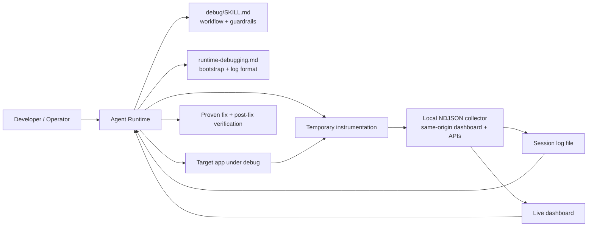
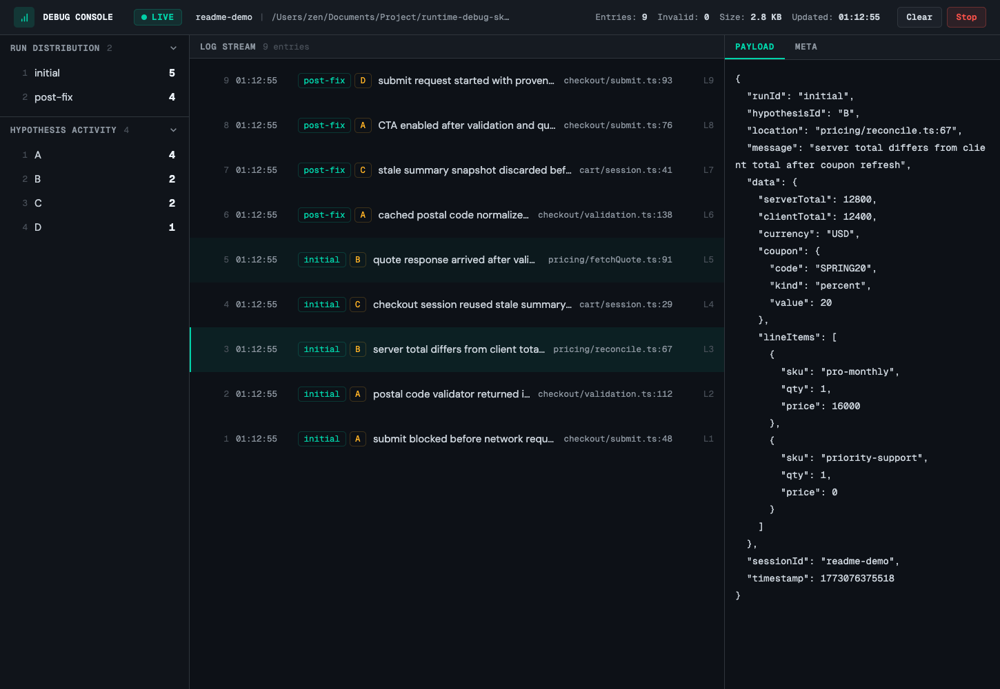

# JUNERDD Skills

<p align="center">
  
</p>

Reusable AI agent skills published from a single repository.

This repository is a skill collection, not a single-skill package. Installable skills live under [`skills/`](./skills/), and each subfolder is meant to be independently installable, versioned, and expanded over time.

## Skills At A Glance

If you are deciding what to install, start here:

- [`comment-strategist`](#comment-strategist) - add high-value code comments without comment noise
- [`git-commit`](#git-commit) - draft a Conventional Commit message from the staged diff
- [`split-commits`](#split-commits) - split a mixed working tree into focused local commits
- [`debug`](#debug) - debug runtime issues with an evidence-first logging workflow
- [`hack-review`](#hack-review) - review whether an implementation relies on brittle hack-like shortcuts
- [`receiving-hack-review`](#receiving-hack-review) - consume a hack-review report and verify each finding before changing code
- [`regression-review`](#regression-review) - review code changes for user-visible behavioral regressions
- [`receiving-regression-review`](#receiving-regression-review) - consume a regression-review report and verify each finding before changing code

## Install

The CLI examples below intentionally use the latest `skills` tool version to avoid mismatches with older local installs.

List the skills currently published from this repository:

```bash
npx skills@latest add JUNERDD/skills --list
```

Install a specific skill:

```bash
npx skills@latest add JUNERDD/skills --skill <skill-name>
```

Install globally for Codex:

```bash
npx skills@latest add JUNERDD/skills --skill <skill-name> -g -a codex -y
```

Examples:

```bash
npx skills@latest add JUNERDD/skills --skill debug
npx skills@latest add JUNERDD/skills --skill git-commit
npx skills@latest add JUNERDD/skills --skill split-commits
npx skills@latest add JUNERDD/skills --skill comment-strategist
npx skills@latest add JUNERDD/skills --skill hack-review
npx skills@latest add JUNERDD/skills --skill receiving-hack-review
npx skills@latest add JUNERDD/skills --skill regression-review
npx skills@latest add JUNERDD/skills --skill receiving-regression-review
```

Manual install still works if your runtime does not use the `skills` CLI. Copy one or more skill folders into your local skill directory:

```bash
mkdir -p ~/.agents/skills
cp -R ./skills/git-commit ./skills/split-commits ./skills/comment-strategist ./skills/hack-review ./skills/receiving-hack-review ./skills/regression-review ./skills/receiving-regression-review ~/.agents/skills/
```

## Repository Model

- Each installable skill lives under `skills/<skill-name>/`.
- Each skill owns its own `SKILL.md` plus any optional `agents/`, `references/`, `scripts/`, or `assets/` directories.
- Root-level files describe the repository as a collection. Skill-specific behavior and deep operational details stay inside the relevant skill folder.
- Shared repository assets such as screenshots can live outside `skills/` when they are not part of the installable package itself.

## Current Skills

Use the anchor list above for a quick jump, then read the section that matches your task.

### `comment-strategist`

[`skills/comment-strategist/`](./skills/comment-strategist/) is for documenting existing code without adding low-value comment noise. It focuses on intent, contracts, constraints, field meaning, and control-flow rationale instead of rewriting syntax in prose.

Install:

```bash
npx skills@latest add JUNERDD/skills --skill comment-strategist
```

Best for:

- documenting exported functions, interfaces, classes, and config objects
- replacing outdated or redundant comments with durable explanations
- adding guided comments inside complex logic while preserving the local comment style

Key entry points:

- Workflow and guardrails: [`skills/comment-strategist/SKILL.md`](./skills/comment-strategist/SKILL.md)
- Optional runtime metadata: [`skills/comment-strategist/agents/openai.yaml`](./skills/comment-strategist/agents/openai.yaml)

### `git-commit`

[`skills/git-commit/`](./skills/git-commit/) drafts a Conventional Commit message from the staged diff only. It is intentionally narrow: it reads what is already staged, proposes one accurate message, and does not mutate Git state.

Install:

```bash
npx skills@latest add JUNERDD/skills --skill git-commit
```

Best for:

- generating a clean commit subject from the current index
- checking whether a staged batch is too mixed for one honest commit message
- keeping commit wording grounded in staged files instead of unstaged work

Key entry points:

- Workflow and guardrails: [`skills/git-commit/SKILL.md`](./skills/git-commit/SKILL.md)
- Optional runtime metadata: [`skills/git-commit/agents/openai.yaml`](./skills/git-commit/agents/openai.yaml)

### `split-commits`

[`skills/split-commits/`](./skills/split-commits/) helps break a mixed working tree into a sequence of focused local commits. It stages one logical batch at a time, asks `$git-commit` for a message, and requires explicit confirmation before each `git commit`.

Install:

```bash
npx skills@latest add JUNERDD/skills --skill split-commits
```

Best for:

- separating unrelated concerns in the same working tree
- isolating refactors from behavior changes
- building a short series of reviewable local commits without pushing

Key entry points:

- Workflow and guardrails: [`skills/split-commits/SKILL.md`](./skills/split-commits/SKILL.md)
- Optional runtime metadata: [`skills/split-commits/agents/openai.yaml`](./skills/split-commits/agents/openai.yaml)

### `debug`

[`skills/debug/`](./skills/debug/) provides evidence-first runtime debugging for application bugs, regressions, flaky behavior, and unclear runtime failures. It is the most operational skill in the repository and includes both workflow guidance and a local log collector.

Install:

```bash
npx skills@latest add JUNERDD/skills --skill debug
```

Key entry points:

- Workflow and guardrails: [`skills/debug/SKILL.md`](./skills/debug/SKILL.md)
- Operator reference: [`skills/debug/references/runtime-debugging.md`](./skills/debug/references/runtime-debugging.md)
- Local NDJSON collector: [`skills/debug/scripts/local_log_collector/`](./skills/debug/scripts/local_log_collector/)
- Optional runtime metadata: [`skills/debug/agents/openai.yaml`](./skills/debug/agents/openai.yaml)

### `debug` Skill Snapshot

The `debug` skill is designed to prevent speculative fixes by forcing a prove-it loop:

1. Generate precise hypotheses.
2. Attach to or start an authoritative logging session.
3. Add minimal temporary instrumentation.
4. Reproduce the issue and read the recorded log file.
5. Mark each hypothesis as `CONFIRMED`, `REJECTED`, or `INCONCLUSIVE`.
6. Apply a fix only after the root cause is proven.
7. Verify with fresh post-fix logs before removing instrumentation.

This keeps the skill focused on evidence, not guesswork.

### `debug` Architecture



### `debug` Highlights

- Evidence-first debugging instead of inspection-only reasoning
- Minimal instrumentation with explicit cleanup after verification
- Per-hypothesis logging and before/after comparison
- Local collector bootstrap when the host does not already provide logging
- Browser-first log transport for frontend debugging, with explicit prohibition on app-local proxy routes unless direct delivery is proven blocked

### `debug` Runtime Support

The current `debug` skill is intentionally portable. It works with:

- OpenAI Codex and similar local-skill runtimes
- Agent shells that read `~/.agents/skills/<name>/SKILL.md`
- Custom agent frameworks that mount a skill folder and inject `SKILL.md` into context
- Internal toolchains that want the collector, references, or workflow as reusable assets

If your runtime ignores [`skills/debug/agents/openai.yaml`](./skills/debug/agents/openai.yaml), the core logic is still fully available through [`skills/debug/SKILL.md`](./skills/debug/SKILL.md).

### `debug` Dashboard Preview



### `debug` Collector

The bundled collector is a zero-dependency Python app built on the standard library. It accepts JSON log events, appends them to an NDJSON file, and serves a same-origin dashboard for live inspection.

For frontend and browser debugging, the intended transport is direct client-to-collector HTTP posting. The collector already handles CORS and preflight, so the skill should not create temporary Next.js API routes or other app-local proxy layers unless direct browser delivery has been proven blocked in the current host.

Collector endpoints:

- `POST /ingest`
- `GET /health`
- `GET /api/state`
- `GET /api/logs`
- `GET /api/logs/detail`
- `POST /api/clear`
- `POST /api/shutdown`

Minimal smoke test:

```bash
mkdir -p .debug-logs
python3 skills/debug/scripts/local_log_collector/main.py \
  --log-file "$PWD/.debug-logs/demo.ndjson" \
  --ready-file "$PWD/.debug-logs/demo.json" \
  --session-id "demo-session"
```

### `hack-review`

[`skills/hack-review/`](./skills/hack-review/) reviews whether an implementation is relying on hack-like tactics instead of sound ownership and abstraction boundaries. It produces a reviewer-facing gate report rather than a vague smell list.

Install:

```bash
npx skills@latest add JUNERDD/skills --skill hack-review
```

Best for:

- identifying impossible-state fallbacks that hide a broken invariant
- flagging symptom-masking patches that do not fix the root cause
- catching duplicate abstractions or parallel wheels when a stable boundary already exists

Key entry points:

- Workflow and guardrails: [`skills/hack-review/SKILL.md`](./skills/hack-review/SKILL.md)
- Report template: [`skills/hack-review/references/report-template.md`](./skills/hack-review/references/report-template.md)
- Optional runtime metadata: [`skills/hack-review/agents/openai.yaml`](./skills/hack-review/agents/openai.yaml)

### `receiving-hack-review`

[`skills/receiving-hack-review/`](./skills/receiving-hack-review/) consumes a `hack-review` report and decides whether each finding still applies, should be fixed, should be challenged, or is actually a bounded intentional exception.

Install:

```bash
npx skills@latest add JUNERDD/skills --skill receiving-hack-review
```

Best for:

- re-checking that a hack report matches the exact requested review scope
- fixing ownership problems without mechanically deleting necessary guards
- narrowing or disproving hack findings with stronger code-path evidence

Key entry points:

- Workflow and guardrails: [`skills/receiving-hack-review/SKILL.md`](./skills/receiving-hack-review/SKILL.md)
- Optional runtime metadata: [`skills/receiving-hack-review/agents/openai.yaml`](./skills/receiving-hack-review/agents/openai.yaml)

### `regression-review`

[`skills/regression-review/`](./skills/regression-review/) reviews whether the current change set introduces user-visible behavioral regressions. It writes a reviewer-facing gate report organized around `Block`, `Discuss`, `Watch`, and `Intentional Changes`.

Install:

```bash
npx skills@latest add JUNERDD/skills --skill regression-review
```

Best for:

- checking whether a refactor or feature work breaks user-facing flows
- auditing changed defaults, loading states, retries, ordering, or exported output
- writing a review artifact that keeps severity aligned with the strongest unresolved finding

Key entry points:

- Workflow and guardrails: [`skills/regression-review/SKILL.md`](./skills/regression-review/SKILL.md)
- Report template: [`skills/regression-review/references/report-template.md`](./skills/regression-review/references/report-template.md)
- Optional runtime metadata: [`skills/regression-review/agents/openai.yaml`](./skills/regression-review/agents/openai.yaml)

### `receiving-regression-review`

[`skills/receiving-regression-review/`](./skills/receiving-regression-review/) consumes a `regression-review` report and decides whether each finding still applies, should be fixed, should be challenged, or should remain as an intentional product change.

Install:

```bash
npx skills@latest add JUNERDD/skills --skill receiving-regression-review
```

Best for:

- re-checking a regression gate against the current diff and baseline
- fixing only proven user-visible regressions instead of blindly following review comments
- separating real regressions from intentional product deltas with stronger evidence

Key entry points:

- Workflow and guardrails: [`skills/receiving-regression-review/SKILL.md`](./skills/receiving-regression-review/SKILL.md)
- Optional runtime metadata: [`skills/receiving-regression-review/agents/openai.yaml`](./skills/receiving-regression-review/agents/openai.yaml)

## Growing The Repository

When you add more skills later:

- Create a new folder under `skills/<skill-name>/`.
- Keep each skill self-contained so it can be installed independently.
- Add or update `agents/`, `references/`, `scripts/`, and `assets/` only when they materially help that specific skill.
- Update the `Current Skills` section in this README with a one-line summary and relevant links.
- Keep repo-level README content about the collection itself; move deep procedural detail into the skill that owns it.

## Repository Layout

```text
.
├── LICENSE
├── README.md
├── docs/
│   └── images/
│       └── dashboard-overview.png
└── skills/
    ├── comment-strategist/
    │   ├── SKILL.md
    │   └── agents/
    │       └── openai.yaml
    ├── debug/
    │   ├── SKILL.md
    │   ├── agents/
    │   │   └── openai.yaml
    │   ├── references/
    │   │   └── runtime-debugging.md
    │   └── scripts/
    │       └── local_log_collector/
    │           ├── main.py
    │           ├── collector_server.py
    │           ├── collector_state.py
    │           ├── collector_browser.py
    │           └── static/
    ├── git-commit/
    │   ├── SKILL.md
    │   └── agents/
    │       └── openai.yaml
    ├── hack-review/
    │   ├── SKILL.md
    │   ├── agents/
    │   │   └── openai.yaml
    │   └── references/
    │       └── report-template.md
    ├── receiving-hack-review/
    │   ├── SKILL.md
    │   └── agents/
    │       └── openai.yaml
    ├── receiving-regression-review/
    │   ├── SKILL.md
    │   └── agents/
    │       └── openai.yaml
    ├── regression-review/
    │   ├── SKILL.md
    │   ├── agents/
    │   │   └── openai.yaml
    │   └── references/
    │       └── report-template.md
    └── split-commits/
        ├── SKILL.md
        └── agents/
            └── openai.yaml
```

## License

Released under the [MIT License](./LICENSE).
